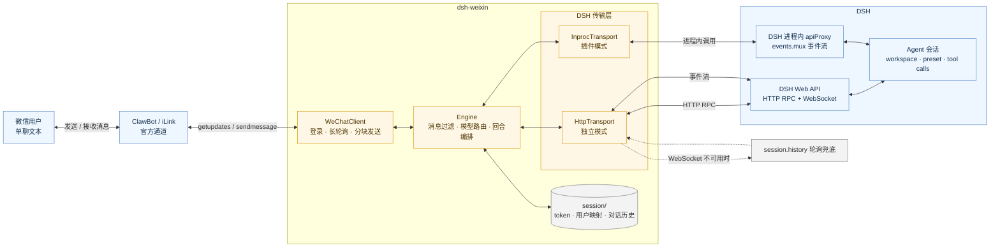

# dsh-weixin

`dsh-weixin` 是一个把微信 ClawBot/iLink 官方通道接入 DSH 的桥接器。它接收微信单聊文本，将消息交给 DSH agent，再把结果发送回微信；同一套核心同时支持独立进程和 DSH 插件两种运行方式。

## 架构图



消息从微信进入 `WeChatClient`，由 `Engine` 负责过滤、会话绑定、模型选择和回合编排；结果再沿原链路返回微信。独立模式通过 DSH Web 的 HTTP RPC 与事件流通信，插件模式则直接使用 DSH 进程内 `apiProxy`。

项目使用腾讯 ClawBot/iLink 通道，但不承诺账号不会受到平台策略、权限或限流影响；使用前请遵守微信相关服务条款。

## 功能概览

- 微信单聊文本与 DSH agent 双向转发。
- 每个微信用户生成稳定的独立 DSH 会话 ID（`wx-` 前缀）。
- 自动创建或复用名为“微信会话”的 DSH workspace；workspace 不可用时降级为不分组会话。
- agent 发起提问时转发到微信，用户直接回复即可提交答案。
- 复杂任务先发送“正在思考”提示，并切换到复杂任务模型；短消息默认使用快速模型。
- 回合超过等待阈值时发送处理中提示，超过总超时则取消 DSH 回合。
- 长回复按固定长度拆分为多条微信消息。
- 本地保存登录状态、用户与会话映射，以及微信侧与 DSH 侧的对话镜像。
- 不依赖第三方微信客户端；Node.js 22 的 `fetch` 和 `WebSocket` 用于通信。

## 运行方式

| 模式 | 命令 | 适用场景 | 与 DSH 的连接方式 |
| --- | --- | --- | --- |
| 独立模式 | `npm start` | 快速运行、调试或单独部署 | HTTP RPC + WebSocket；WebSocket 持续不可用时，回复事件降级为 `session.history` 轮询 |
| 插件模式 | `npm run install` | 随 DSH Web 一起运行 | 进程内 `apiProxy`，直接消费 `apiProxy.events.mux()`，不经过 HTTP/WebSocket |

两种模式共用 `src/core/` 和 `src/dsh/transport.mjs` 的消息编排逻辑，区别只在 DSH 传输层实现。

## 环境要求

### 独立模式

- Node.js `>= 22`。
- 一个正在运行的 DSH Web 服务，默认地址为 `http://127.0.0.1:3080`。
- 首次登录需要能打开 Edge 或 Chrome 扫码窗口；也可以通过 `WX_BOT_BROWSER` 指定浏览器可执行文件。

### 插件模式

- Node.js `>= 22`。
- DSH 源码工作区，以及可用的 `pnpm`。
- 安装脚本需要能够修改 DSH 源码目录和用户级 `cordis.patch.yml`。

## 快速开始：独立模式

先启动 DSH Web，再在本项目根目录执行：

```bash
npm start
```

首次运行时，程序会从微信官方接口获取登录页，并优先使用 Edge/Chrome 的独立应用窗口打开扫码页。扫码成功后窗口会自动关闭；若未找到 Edge/Chrome，则会退回系统默认浏览器，登录完成后需要手动关闭页面。

登录成功后，程序会持续接收微信消息。只处理单聊文字消息：群聊会被忽略，图片、语音和文件消息会收到“不支持文字以外消息”的提示。

登录 token 和长轮询游标会保存到 `session/bot.json`。运行时还会生成 `session/users.json`、`session/history/` 以及扫码备用链接等文件；这些内容都属于本地运行数据，不应提交到版本库。

## 安装为 DSH 插件

安装脚本会执行以下操作：

1. 将 `src/` 和插件清单复制到 DSH 源码的 `packages/dsh-weixin/dsh-weixin/`。
2. 在用户级 `$DSH_HOME/cordis.patch.yml` 追加 `dsh-weixin` 挂载配置。
3. 在 DSH 源码根目录执行 `pnpm install`，使 workspace 发现新插件。

执行：

```bash
npm run install
```

安装脚本默认按以下顺序探测 DSH 源码根目录：

1. `DSH_ROOT` 环境变量指定的目录。
2. `D:\Program Files\dsh`。
3. 本项目内的 `dsh\` 目录。

如果自动探测不到，可以显式指定：

```powershell
$env:DSH_ROOT = 'D:\path\to\dsh'
$env:DSH_HOME = 'C:\Users\me\.dsh'
npm run install
```

同一版本已经安装时，脚本会跳过复制；需要强制重新复制时使用：

```bash
npm run install -- --force
```

安装完成后重启 DSH：停止当前进程，再重新执行 `pnpm dsh web`。安装脚本生成的插件配置默认使用当前项目的 `session/` 目录、当前项目作为会话工作目录、`微信会话` 作为 workspace 名称，以及 `weixin` agent preset。

### 卸载插件

停止 DSH 后，在项目根目录执行：

```bash
npm run uninstall
```

卸载脚本会移除 DSH 源码中的 `packages/dsh-weixin/`、profile 模块链接和 `$DSH_HOME/cordis.patch.yml` 中由本插件添加的 `id: dsh-weixin` 配置块；随后重新启动 DSH 即可。

## 配置

独立模式通过环境变量配置。插件模式会读取表中适用的 `WX_BOT_*` 环境变量；`DSH_URL` 仅用于独立模式。插件配置还可以直接传入 `sessionDir`、`sessionCwd`、`workspaceTitle`、`preset`、`slowAckMs`、`turnTimeoutMs`、`chunkSize` 和 `pollTimeoutMs`。

| 变量 | 默认值 | 说明 |
| --- | --- | --- |
| `DSH_URL` | `http://127.0.0.1:3080` | 独立模式下的 DSH Web 地址 |
| `WX_BOT_SESSION_DIR` | `<项目根>/session` | 登录状态、用户映射和对话镜像的目录 |
| `WX_BOT_CWD` | `<项目根>` | 创建 DSH 会话时使用的工作目录 |
| `WX_BOT_PRESET` | `weixin` | DSH agent preset 名称 |
| `WX_BOT_TURN_TIMEOUT_MS` | `900000` | 单个 DSH 回合最大等待时间，默认 15 分钟；超时后调用 `session.cancel` |
| `WX_BOT_SLOW_ACK_MS` | `4000` | 简单任务超过该时间仍未完成时发送处理中提示 |
| `WX_BOT_CHUNK_SIZE` | `1800` | 单条微信回复的分块长度 |
| `WX_BOT_POLL_TIMEOUT_MS` | `5000` | 微信 `getupdates` 长轮询基准超时；服务端返回的超时值优先 |
| `WX_BOT_BROWSER` | 自动探测 Edge/Chrome | 扫码窗口使用的浏览器可执行文件路径 |
| `WX_BOT_FAST_MODEL` | `deepseek-official/deepseek-v4-flash` | 简单短消息使用的模型 |
| `WX_BOT_FAST_REASONING` | `off` | 快速模型的思考档位 |
| `WX_BOT_COMPLEX_MODEL` | `deepseek-official/deepseek-v4-pro` | 复杂任务使用的模型 |
| `WX_BOT_COMPLEX_REASONING` | `high` | 复杂任务的思考档位 |
| `WX_BOT_COMPLEX_ACK_TEXT` | `好的，我先思考一下，稍后给你结果…` | 复杂任务开始前发送的提示文字 |

模型变量支持 `provider/model` 格式。例如：

```powershell
$env:WX_BOT_FAST_MODEL = 'deepseek-official/deepseek-v4-flash'
$env:WX_BOT_FAST_REASONING = 'off'
$env:WX_BOT_COMPLEX_MODEL = 'deepseek-official/deepseek-v4-pro'
$env:WX_BOT_COMPLEX_REASONING = 'high'
npm start
```

### 任务路由规则

当前实现使用轻量规则判断复杂度：文本长度超过 40 个字符，或命中写入、执行、安装、搜索、分析、文件、代码、命令、Git、数据库等动作关键词时，视为复杂任务。规则不是模型分类器，误判时会沿用当前会话模型或按配置继续执行。

模型切换失败不会阻塞消息处理，程序会继续使用 DSH 会话当前模型。

## 数据与会话

默认目录结构如下：

```text
session/
├── bot.json                 # botToken、baseUrl、getupdates 游标
├── users.json               # 微信用户到 DSH sessionId 的映射
└── history/
    └── <安全化用户标识>.jsonl # user/assistant 双方消息镜像
```

实现细节：

- `sessionId` 由微信用户标识和 agent preset 的 SHA-256 摘要生成，使用 `wx-` 前缀。
- `bot.json` 中包含登录凭据，应按敏感数据保护，不要上传、分享或提交到 Git。
- `users.json` 和 `history/` 也可能包含用户标识与对话内容。
- JSON 状态文件采用临时文件写入后重命名的方式更新；对话镜像按 JSONL 追加。
- `.gitignore` 已忽略 `session/`、`state/`、临时文件和本地 DSH 副本。

## 消息处理流程

1. `WeChatClient` 确保登录，并通过 iLink `getupdates` 长轮询收取消息。
2. `Engine` 过滤非用户消息、群聊和非文字消息。
3. 传输层按用户和 preset 确保 DSH session 存在，并记录本地用户映射。
4. 根据复杂度选择模型；必要时先发送处理中提示。
5. 将文本发送到 DSH，等待越过当前事件序号水位的 `turn/end`。
6. 把助手文本写入本地历史，并按分块长度发送回微信。
7. 如果 DSH 发送 `question/requested`，则把问题转发到微信；下一条微信文字会作为回答提交，而不是创建新回合。

独立模式的 WebSocket 事件流连续不可用超过约 15 秒后，会轮询 `session.history` 来保证普通回复尽量不丢失；但历史轮询无法替代提问事件，因此此时 agent 提问转发可能不可用。插件模式直接消费进程内事件流，不依赖这条网络降级链路。

## 目录结构

```text
dsh-weixin/
├── package.json             # 项目元数据与 npm scripts
├── version.json             # 插件安装版本
├── install.mjs              # 安装/更新 DSH 插件
├── diag-deliver.mjs         # 手工投递诊断脚本，非正常启动入口
├── src/
│   ├── core/
│   │   ├── wechat.mjs       # iLink 登录、长轮询、上线/下线、发消息
│   │   ├── engine.mjs       # 微信消息与 DSH 回合的核心编排
│   │   ├── store.mjs        # session/ 本地持久化
│   │   └── log.mjs          # 为 console 日志添加时间戳
│   ├── dsh/
│   │   ├── transport.mjs    # 两种模式共享的回合、提问、超时逻辑
│   │   ├── http.mjs         # 独立模式 HTTP/WebSocket 传输
│   │   └── inproc.mjs       # 插件模式进程内 apiProxy 传输
│   ├── standalone/
│   │   └── main.mjs         # npm start 入口
│   └── plugin/
│       ├── index.mjs        # DSH 插件入口
│       └── package.json      # 插件包清单
└── session/                 # 运行时生成，默认不提交
```

## 已知限制

- 当前只处理微信单聊文字消息；群聊、图片、语音和文件消息不会交给 DSH。
- DSH approval/requested 审批仍需要在 DSH Web 界面处理。
- 独立模式的 WebSocket 失联后，普通回合可通过历史轮询兜底，但 agent 提问转发可能失效。
- DSH 服务不可用时无法创建会话、发送消息或接收回合结果。
- 会话历史是本地明文 JSONL；请自行设置文件权限、备份策略和保留周期。
- `diag-deliver.mjs` 会直接读取本地 `session/bot.json` 并尝试向目标用户投递测试消息，只适合人工诊断，使用前请确认目标参数和 token 安全。

## 参考

- [腾讯 ClawBot 官方接口文档](https://developers.weixin.qq.com/doc/aispeech/knowledge/openapi/Clawbotrelated.html)
- [iLink/ClawBot 协议技术解析（openclaw-weixin）](https://github.com/hao-ji-xing/openclaw-weixin/blob/main/weixin-bot-api.md)
- [@tencent-weixin/openclaw-weixin](https://www.npmjs.com/package/@tencent-weixin/openclaw-weixin)
